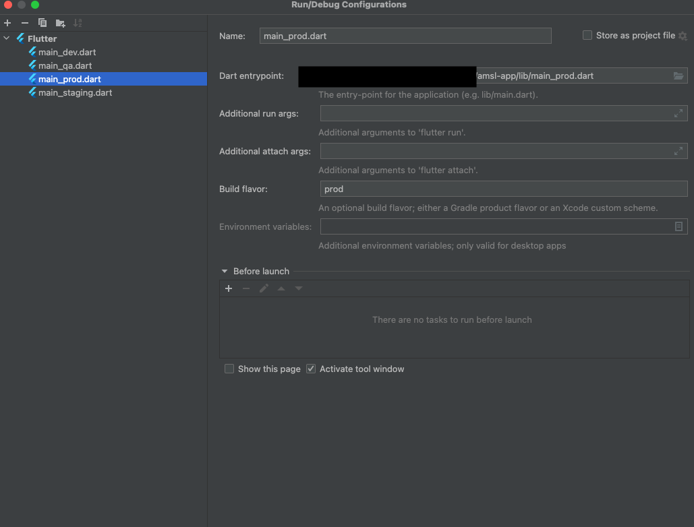

# amsl-app

The iOS and Android frontend of Amsl.

## Getting Started

This project is a starting point for a Flutter application.

- Flutter version 3.38.7

## Running the app

## Local setup

Generate local config files with anonymized values:

```bash
make setup-local
```

This will:

- create `.env` from `.env.example` if missing
- write flavor/auth/tracking values directly into `lib/flavors.dart` and `lib/features/tracking/tracking.dart`
- write `android/app/google-services.json`
- write `ios/Runner/GoogleService-Info.plist`

Optional on macOS for iOS signing:

- set `IOS_DEVELOPMENT_TEAM=<your_team_id>` in `.env`
- run `make setup-local` to apply it to `ios/Runner.xcodeproj/project.pbxproj`

Optional git clean filter for `*.env`:

```bash
make print-git-filter-setup
```

If you want to reset `.env` back to the template:

```bash
make setup-local-force
```

Use the flavor dependent main files

From the command line:
```bash
flutter run --flavor dev lib/main_dev.dart
```

From Android Studio


