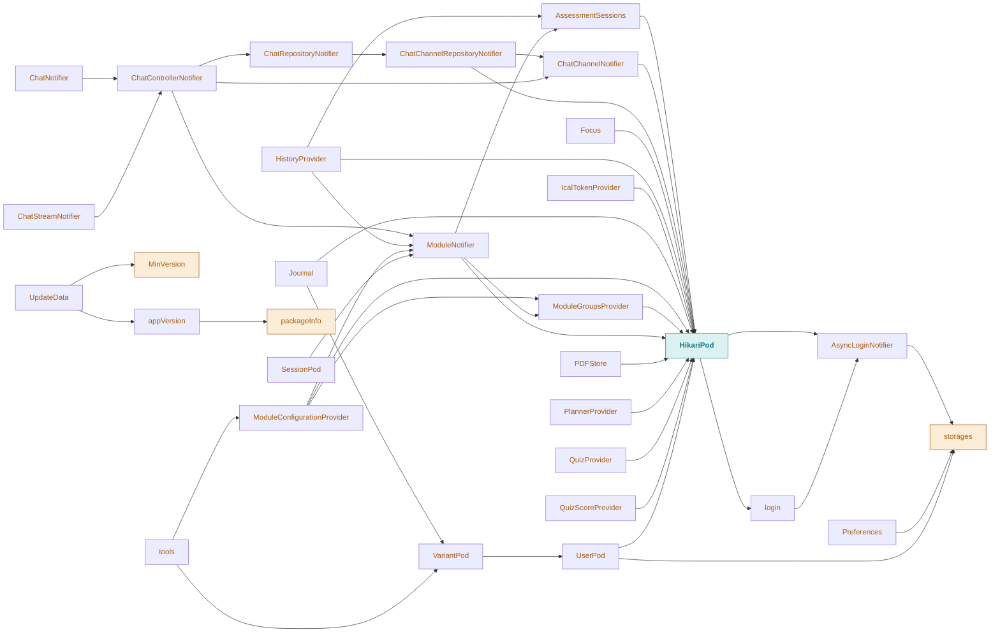

# Provider dependency graph

Generated by `scripts/provider_graph.py` from the declared `@Riverpod(dependencies: [...])`. Do not edit by hand — re-run the script.

Arrows point from a provider to what it depends on. Amber = root (no deps); teal = the `HikariPod` hub.

